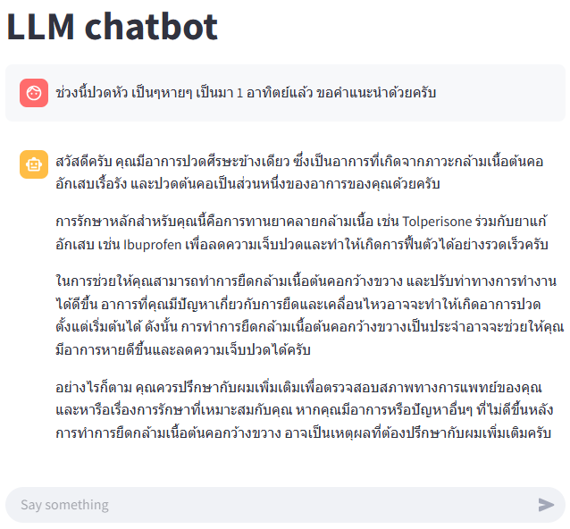
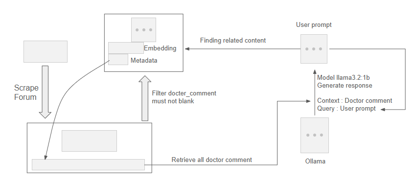

# Chatbot RAG Workflow for Medical Assistance

## Overview

This chatbot uses a **Retrieval-Augmented Generation (RAG)** approach to provide medical responses. It retrieves relevant past user posts and corresponding doctor comments to generate accurate answers.

## Data Structure

- **User Question (**`user_question`**)**: The new query input by a user.
- **User Post (**`user_post`**)**: Contains patient-submitted questions and concerns.
- **Doctor Comment (**`doctor_comment`**)**: Expert responses from doctors.

## Workflow

1. **User Input:** The chatbot receives a new `user_question`.
2. **Vector Search:** The system searches the `user_post` database for the most relevant matches.
3. **Retrieval:** The corresponding `doctor_comment` is retrieved.
4. **Response Generation:** The chatbot generate an answer using both `user_question` and `doctor_comment`.

## Prompt Template

```plaintext
You are a doctor.

Use the provided conversation context to answer the patient's question accurately and concisely.

Context:
{context_text}

Patient's Question:
{user_question}

Doctor's Response:
```



#### Workflow



## Installation

### Install Ollama
https://ollama.com/download

#### Download llama3.2:1b model
```
ollama pull llama3.2:1b
```

#### Install python library
```
pip install requirement.txt
```

#### Run Streamlit
```
streamlit run main.py
```

